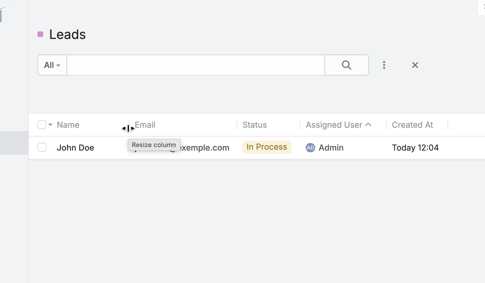
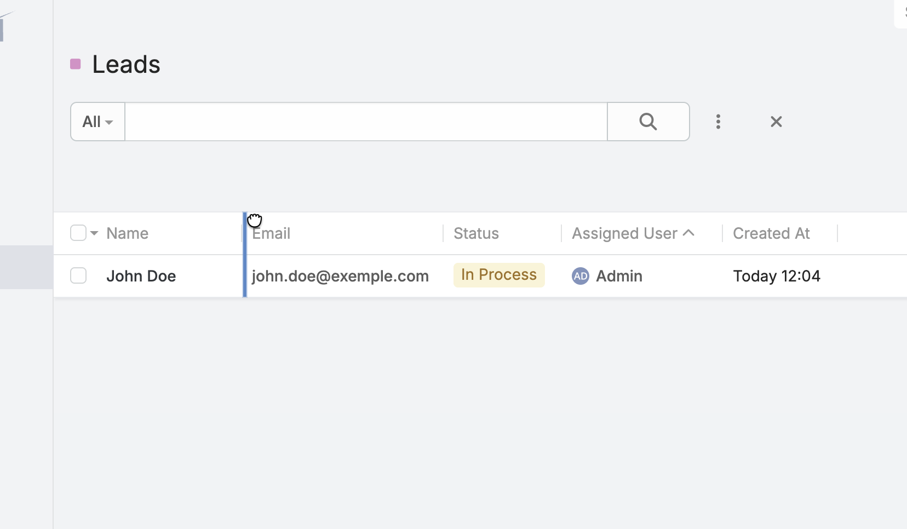
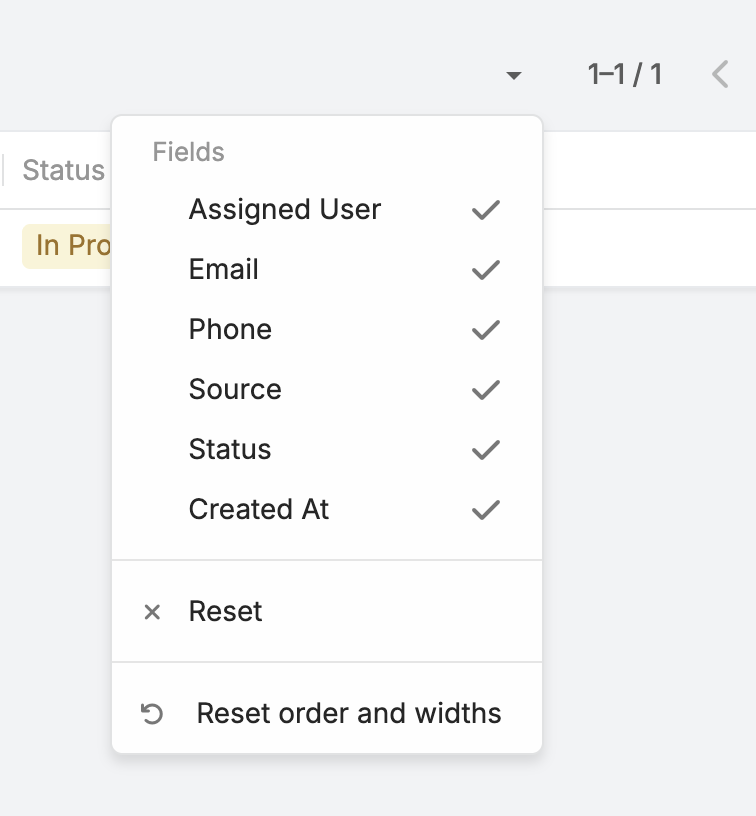
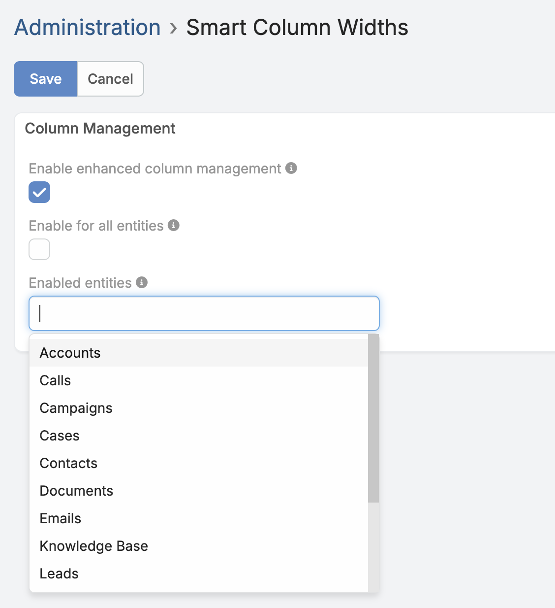

# Smart Column Widths for EspoCRM

Smart Column Widths adds column resizing, double-click auto-fit, reordering and
reset controls to EspoCRM list views.

Current version: **0.2.2** · [Download the latest release](https://github.com/AlexisSantin/espocrm-smart-column-widths/releases/latest)

## Interaction reference

| Action | Result |
| --- | --- |
| Hover near a header boundary | Shows the column-resize cursor |
| Drag a header boundary | Changes only that column's width |
| Double-click a header boundary | Auto-fits the column to rendered content |
| Drag empty header space | Moves the header and all corresponding cells |
| Click a sortable header label | Keeps EspoCRM's native sorting |
| Change visible columns | Keeps the native column menu open |
| Reset Order and Widths | Restores administrator order and recalculates widths |
| Navigate away and return | Restores the personal layout |

## Features

### Resize any visible column

- Move the pointer near the right edge of a column header to reveal the
  resize cursor.
- Drag the boundary to change only that column's width.
- The interaction area extends a few pixels on both sides of the separator,
  making the boundary easier to acquire without requiring pixel-perfect
  positioning.
- Column widths have a compact common minimum, including text, links,
  enumerations and boolean fields.
- Resizing one column does not redistribute the remaining space between the
  other columns.
- When the total width exceeds the list container, EspoCRM's horizontal
  scrolling remains available.

The native **Column Resize** toggle is hidden while Smart Column Widths is
active because resizing is always available directly from the headers.



### Double-click to auto-fit

Double-click a column boundary to fit that column to its rendered content.

Auto-fit measures the current list rows and accounts for:

- text and links;
- email addresses and phone numbers;
- enum labels and their color indicators;
- badges and other label decoration;
- checkboxes and form controls;
- field padding and borders.

The result keeps a compact minimum and a safe maximum so that a single long
value cannot create an excessively wide column.

### Reorder complete columns

- Drag an unused area of a column header to move the column.
- The header and every corresponding row cell move together.
- A short movement is ignored to prevent accidental reordering.
- Native interactive content has priority. Clicking a sortable header label,
  link, button or resize boundary keeps its original EspoCRM action.
- A visual guide shows the destination while dragging.

Reordering changes only the current user's presentation. It does not modify
the administrator's list layout.



### Persistent personal layout

Widths and order are stored locally through EspoCRM's browser storage.
Preferences are separated by:

- EspoCRM user;
- entity type;
- list layout.

Each user can therefore organize Leads, Contacts, Accounts and custom
entities independently without affecting other users.

Preferences stay on the same browser and computer. They are not synchronized
between devices. Clearing the browser's site storage also clears these
personal column preferences.

### Safe layout reconciliation

Smart Column Widths always starts from the current list layout configured by
an administrator.

When that layout changes:

- newly activated columns are inserted into the personal order;
- removed columns are discarded from stored preferences;
- hidden or unauthorized fields cannot be restored from local storage;
- native column-visibility choices remain untouched.

Only columns active in EspoCRM's **Administration → Entity Manager → Layouts
→ List** layout are managed by the extension.

### Column menu behavior

EspoCRM's native list settings menu remains responsible for showing and
hiding columns. The menu stays open while column choices are changed, making
it possible to configure several columns without reopening it each time.

Smart Column Widths adds:

**Reset Order and Widths**

This action:

- clears the current user's stored order and widths for that list;
- restores the order from the administrator's current list layout;
- recalculates initial widths for the available list area;
- keeps the default view contained in the viewport whenever the number of
  columns makes that possible.

It does not reset which fields are active in the administrator's layout.



### Reliable EspoCRM navigation

EspoCRM caches some list views when users move between entities. Smart Column
Widths handles that lifecycle explicitly, so resizing and reordering remain
active after navigating away from a list and returning to it.

The extension also observes list re-rendering after pagination, sorting,
searches and column changes, then reapplies the saved column model without
replacing the whole EspoCRM list view.

## Administration

After installation, open:

**Administration → Customization → Smart Column Widths**

The page provides three settings:

- **Enable enhanced column management** — global on/off switch.
- **Enable for all entities** — enables the extension for every compatible
  entity.
- **Enabled entities** — when the previous option is disabled, selects the
  entities on which Smart Column Widths is available.

The entity selector supports standard and custom object entities. Existing
installations remain enabled until an administrator explicitly restricts the
feature.



## Permissions and ACL

The extension does not grant access to records, entities or fields.

EspoCRM filters the list layout using the current user's entity and
field-level read permissions before Smart Column Widths receives it. Stored
orders and widths are then reconciled only against those authorized columns.

The administration page uses EspoCRM's native Settings model:

- only administrators can open the administration route;
- the server rejects configuration updates from non-administrators;
- the enabled-entity list is filtered according to the current user's scope
  access.

Smart Column Widths changes only table presentation. It does not create,
read, update or delete CRM records through a custom API.

## Installation

1. Download `smart-column-widths-0.2.2.zip` from the
   [latest GitHub release](https://github.com/AlexisSantin/espocrm-smart-column-widths/releases/latest).
2. In EspoCRM, open **Administration → Extensions**.
3. Upload the ZIP file without extracting it.
4. Install the extension.
5. Reload EspoCRM in the browser.
6. Configure the enabled entities under
   **Administration → Customization → Smart Column Widths**.

### Upgrade

Download the newer ZIP and install it from **Administration → Extensions**.
Personal browser widths and orders, as well as administration settings, are
preserved.

### Uninstall

Uninstall the extension from **Administration → Extensions**. CRM records and
administrator list layouts are never modified by the extension.

Local browser preferences may remain in site storage after uninstalling, but
they are harmless and are ignored when the extension is absent.

## Requirements and compatibility

- EspoCRM `>= 10.0.0`
- PHP `>= 8.3`
- A modern desktop browser

Version 0.2.2 has been developed and tested against EspoCRM 10.0.3.

Resize handles are intentionally hidden on small mobile viewports, where
horizontal touch scrolling has priority.

## Troubleshooting

### Resize handles are not available

Check that:

- Smart Column Widths is enabled globally;
- the current entity is enabled in the extension settings;
- the browser viewport is wider than the mobile breakpoint;
- the extension is installed and enabled under
  **Administration → Extensions**.

Reload the browser without cache after installing or upgrading. Depending on
the browser, use `Ctrl+Shift+R` or `Ctrl+F5`.

### Widths differ on another browser or computer

This is expected. Preferences are stored locally for fast, per-device
feedback and are not server-side user preferences.

### An administrator changed the list layout

Reload the list. Smart Column Widths automatically reconciles personal
preferences with the latest active fields and discards obsolete entries.

### Restore the default presentation

Open the list settings menu and choose **Reset Order and Widths**. To remove
all local preferences for the site, clear the site's browser storage.

### The native Column Resize option reappears

Reload without cache and clear EspoCRM's application cache. If the problem
persists, include the EspoCRM version, browser and reproduction steps in a
GitHub issue.

## Repository structure

This repository is based on the official
[EspoCRM extension template](https://github.com/espocrm/ext-template).

Important paths:

```text
src/                 Extension source and packaged files
src/files/           Files installed into EspoCRM
src/tests/           JavaScript behavior and metadata tests
build/               Generated installable ZIP packages
site/                Local EspoCRM development instance
```

Develop the extension only in `src`. The `site` directory is a generated
development copy and must not be edited directly.

## Development

### Prerequisites

- Node.js 18 or newer
- npm 8 or newer
- PHP 8.3 or newer
- Composer
- a local EspoCRM development environment

### Initial setup

```bash
npm install
cp config-default.json config.json
npm run all
```

Adapt `config.json` to the local database and EspoCRM URL before running the
full build.

### Daily workflow

```bash
# Copy source changes into the development EspoCRM instance.
npm run sync

# Clear EspoCRM cache after metadata changes.
npm run clear-cache

# Run behavior and package metadata tests.
npm test

# Build the installable extension.
npm run extension
```

The generated package is written to:

```text
build/smart-column-widths-<version>.zip
```

## Contributing

Issues and pull requests are welcome.

When contributing:

1. Keep extension changes in `src`.
2. Preserve EspoCRM's native sorting, visibility and list interactions.
3. Respect entity, record and field-level ACL.
4. Inspect the implementation in the supported EspoCRM version before using
   an internal list-view property.
5. Add or update tests for behavior changes.
6. Run `npm test` and build the ZIP before opening a pull request.

## Support

Use GitHub Issues for reproducible bugs and feature requests. Include:

- the Smart Column Widths version;
- the EspoCRM version;
- the browser and operating system;
- the affected entity and field types;
- reproduction steps;
- relevant browser-console or EspoCRM log messages.

## Security

Please do not publish credentials, customer records or other sensitive CRM
data in an issue. Use anonymized examples and remove personal information
from screenshots and logs.

## License

Smart Column Widths is free software licensed under the
[GNU General Public License v3.0 or later](LICENSE).

## Author

Created by Alex Santin.
